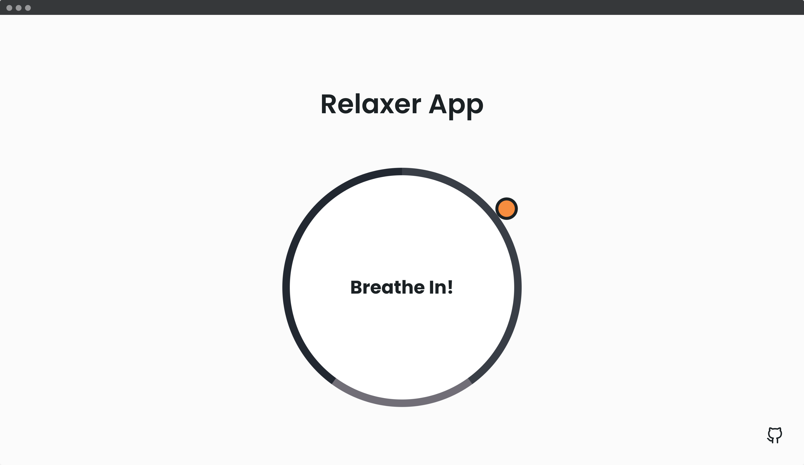

## 📦 Relaxer App

A relaxing breathing app with a visual director to tell you when to breathe in, hold and breathe out.

- Create circle and gradient circle with CSS
- Create and animate pointer (Small circle)
- Create grow and shrink animations
- Add JavaScript to create the breath animation effect

---
#### 🌄 Screenshots:

-----

#### 💻 Stack:

- [JavaScript](https://learn.javascript.ru/)
- [Sass](https://sass-lang.com/)

-----
#### 🙌 Author: [@nagoev-alim](https://github.com/nagoev-alim)
